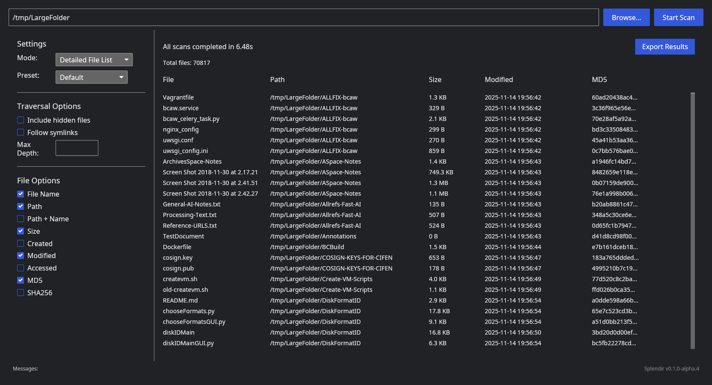
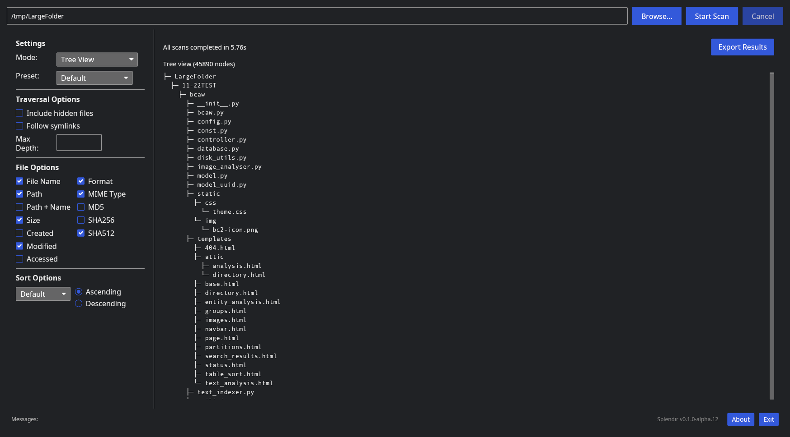
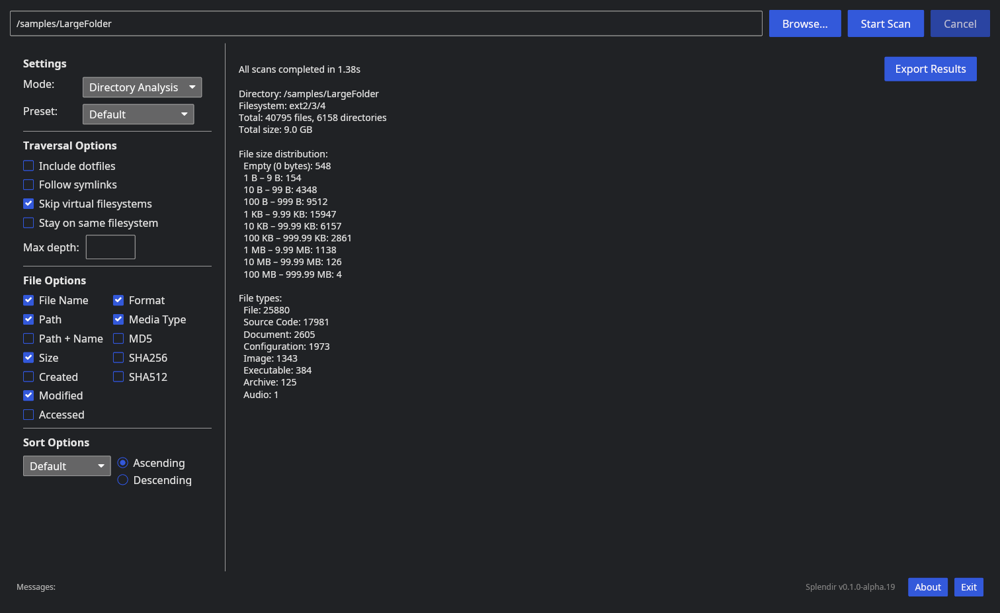

## Splendir 

[](https://github.com/kamwoods/splendir/issues)
[](https://github.com/kamwoods/splendir/actions/workflows/rust.yml)
[](https://opensource.org/licenses/MIT)
[](https://github.com/kamwoods/splendir/network)

### A High Performance Directory Scanner and Printer

Splendir is an extremely fast directory scanner with a GUI interface. Splendir generates tree views of files in a directory, customizable lists of file metadata, and reports of directory contents and file type distributions. Releases include executables for Linux (x64) distros, Windows 11 (x64), and macOS (Apple M-series silicon).

Features:
- Multi-threaded processing for high speed scans and hash calculations
- Virtual scrolling in tree and file list modes for live views of millions of files
- Multiple scan presets
- Live sorting of output in file list view
- File format identification
- Directory listings exported as UTF-8 encoded CSV files, tree structures as UTF-8 encoded text files

Splendir is built in [Rust](https://rust-lang.org/) and implements a GUI in [iced](https://iced.rs/). Multi-threading for hash calculations is implemented using [rayon](https://github.com/rayon-rs/rayon). Splendir is currently in alpha, but releases can be consider "feature complete" for the publicly documented features. The main branch of this repo may include development code that leads the current release.

### Install

Releases include a Ubuntu/Debian package and standalone executables for Linux, Windows 11 (x64) and macOS (Apple silicon). Follow the instructions in one of the sections below.

**Ubuntu/Debian**

Download ```splendir-x64.deb``` from the latest release in [Releases](https://github.com/kamwoods/splendir/releases) and in a terminal run:

```
cd /your/download/directory
sudo dpkg -i splendir-x64.deb
```

**Any Linux**

Download ```splendir-linux-x64.tar.gz``` from the latest release in [Releases](https://github.com/kamwoods/splendir/releases) and extract the .tar.gz file. Then copy the executables to ```/usr/local/bin```:

```
cd /your/download/directory
tar zxvf splendir-linux-x64.tar.gz
sudo cp splendir /usr/local/bin
```

Run the GUI by typing ```splendir``` in the terminal and hitting enter.

**Windows 11**

Download ```splendir-windows-x64.tar.gz``` from the latest release in [Releases](https://github.com/kamwoods/splendir/releases) and extract the files. Double-click on ```splendir.exe``` to run the GUI. A warning may appear that the ```Visual Studio C++ Redistributable``` package needs to be installed first (this can be [downloaded from Microsoft](https://learn.microsoft.com/en-us/cpp/windows/latest-supported-vc-redist?view=msvc-170)). A warning dialog about an unknown developer may appear when running the GUI. Click ```More info``` and select ```Run Anyway```.

**macOS**

Download ```splendir-macos-tar.gz``` from the latest release in [Releases](https://github.com/kamwoods/splendir/releases) and extract the files. Double-clicking on ```splendir``` will generate an untrusted application warning. Navigate to ```Apple Menu > System Settings``` and then select ```Privacy & Security``` in the sidebar. In ```Security```, click ```Open``` and ```Open Anyway```. You will be asked for a login password to confirm.

### Using Splendir

Click the **Browse...** button to select a local directory, then click the **Start Scan** button. The **Mode:** dropdown can be set to **Detailed File List** (outputs a file list with metadata), **Tree View** (outputs a graphical tree view similar to the command-line tool "tree"), or **Directory Analysis** (a high-level overview of the directory contents). All three views are generated when **Start Scan** is clicked. When a scan is complete, an **Export** button will appear to allow export of the content. If **Detailed File List** is currently selected, clicking **Export** will generate a CSV file. If **Tree View** is selected, it will generate a UTF-8 text representation of the tree.

Splendir will distribute work among all available CPU cores to provide maximum performance when running long scans (for example, computing SHA256 hashes for many files). You can terminate a long-running scan by clicking **Cancel** at any time. The scan will be shut down once the most recent batch of 10 files has completed. Clicking **Exit** during a scan will also trigger a cancellation.



Both the **Directory Listing** view and **Tree View** are implemented with a virtual scrolling feature to provide live views of directories of any size. When scanning large directories, you will see a progress report as the tool builds this data structure. Once the directory has been scanned, you can scroll to any point in the output to inspect and review before exporting. You can also adjust the Sort Options to instantly view and export sorted results without having to rescan. The **Default** sort option is an alphabetized directory walk (all subdirectory entries grouped together at each level).



The **Detailed File List** view is exported as a UTF-8 encoded CSV file (this can be conveniently viewed in a spreadsheet), and the **Tree View** is exported as a UTF-8 encoded text file.



The **Directory Analysis** view provides some basic information about the total size of the directory scanned and the types and counts of files encountered.

### Build (Developers and Contributors)

To build, ensure you are using [Rust 1.91.0 or newer](https://www.rust-lang.org/tools/install).

Clone this repo with the command:

```git clone https://github.com/kamwoods/splendir```

Navigate to the root of your cloned directory, and build the Splendir binary with:

```shell
cargo build --release
```

### Contributing

Open an issue in this repository to report bugs or request features, or open a PR to submit updates.

### License

Distributed under the terms of the MIT License. See the LICENSE file for additional details.
