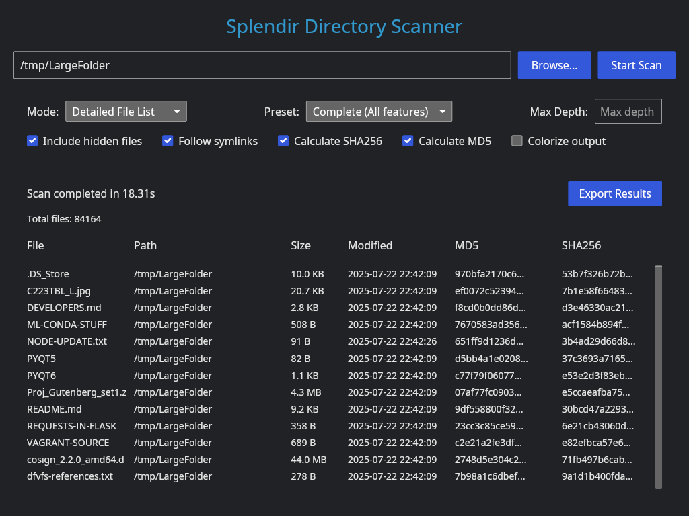
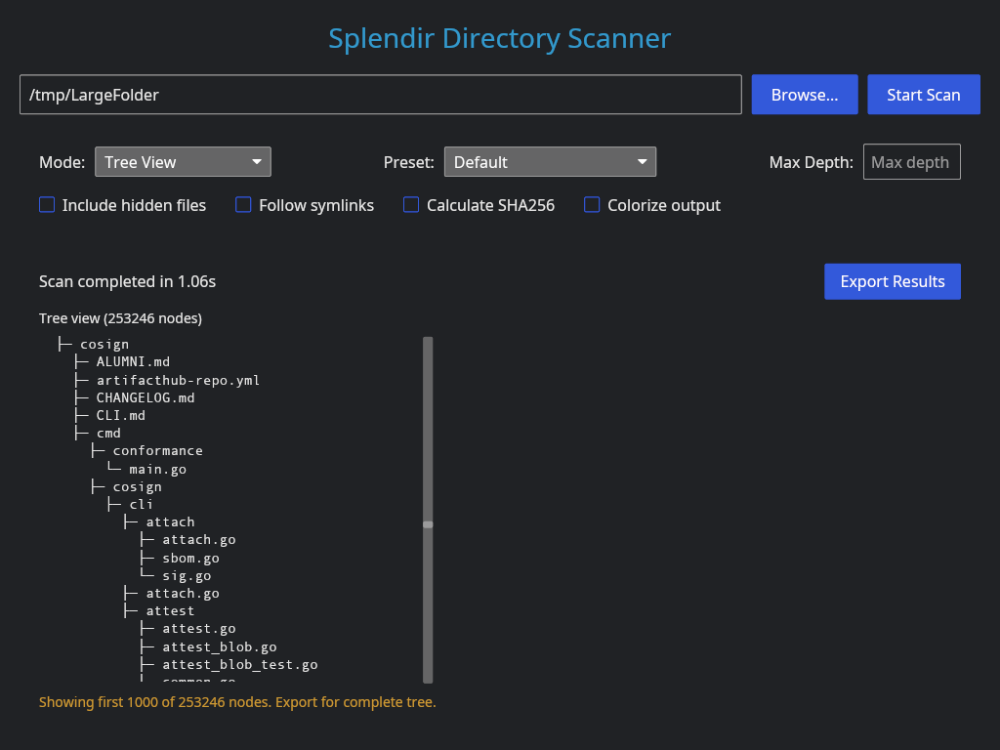

## Splendir 

[](https://github.com/kamwoods/splendir/issues)
[](https://github.com/kamwoods/splendir/actions/workflows/rust.yml)
[](https://github.com/kamwoods/splendir/network)

### A Directory Scanner and Printer

### Splendir is an early WIP. Some features will be missing or broken and both the interface and functionality are subject to change.

Creates tree views of files in a directory, annotated lists of files within a directory, and high-level reports of directory contents and file type distributions.

Splendir is built in Rust and implements a CLI tool, a GUI using Iced, and a reusable library.

### Install

This is a work in progress. Releases and/or binaries might be found in the Releases section, but they are not guaranteed to work.

### Usage (GUI)




### Usage (CLI)

TBD

### Build

To build, ensure you are using Rust 1.88.0 or newer. Build the CLI and GUI binaries with:

```shell
cargo build --release
```

### License

Distributed under the terms of the MIT License. See the LICENSE file for additional details.
