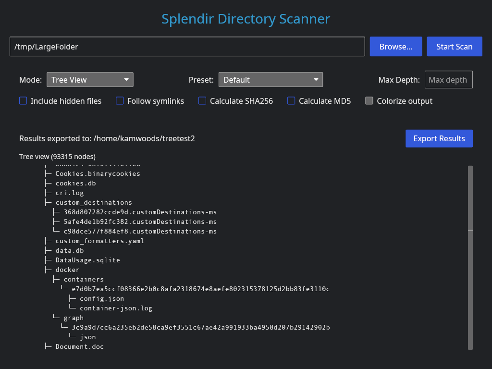

## Splendir 

[](https://github.com/kamwoods/splendir/issues)
[](https://github.com/kamwoods/splendir/actions/workflows/rust.yml)
[](https://github.com/kamwoods/splendir/network)

### A High Performance Directory Scanner and Printer

Splendir is a powerful directory scanner with GUI and CLI interfaces. Splendir tools generate tree views of files in a directory, annotated lists of files within a directory, and high-level reports of directory contents and file type distributions.

Features:
- Dynamically loaded scrollable views entire directory, regardless of size.
- Multithreaded processing
- Calculates SHA256 and MD5 hashes on request
- Shows hidden files and follows symlinks on request
- Exports tree structures as ASCII text files
- Exports directory listings as CSV files

Splendir is built in Rust and implements the GUI using Iced. It is WIP, and some features may be subject to change.

### Install

The Splendir CLI and Splendir GUI are standalone executables. No installation is required. From the Releases section in the main GitHub repo you can download one of the following files:

- Linux executables: ```splendir-linux-x64.tar.gz``` or ```splendir-linux-x64.zip```
- Windows executables: ```splendir-windows-x64.tar.gz``` or ```splendir-windows-x64.zip```
- Mac executables: ```splendir-macos.tar.gz``` or ```splendir-macos.zip```

Extract the files in a location of your choosing. In Linux, you can copy the ```splendir``` and ```splendir_gui``` files to ```/usr/local/bin``` to make them accessible. In Windows, you can simply double-click on ```splendir_gui.exe``` to run it, or run ```splendir.exe``` from PowerShell to use the command-line utility. Windows and macOS may generate warnings about an unknown or untrusted developer. Windows should include an option within the prompt to ```Run Anyway```. In macOS, you can click ```Apple Menu > System Settings``` and then select ```Privacy & Security``` in the sidebar. In ```Security```, click ```Open``` and ```Open Anyway```. You will be asked for a login password to confirm.

### Usage (GUI)

Click the **Browse...** button to select a local directory. Click the **Start Scan** button to begin a scan once you have selected a directory. The **Mode:** dropdown can be set to **Detailed File List** (a columnar list of files), **Tree View** (a graphical tree view similar to the command-line tool "tree"), or **Directory Analysis** (a high-level overview of the directory contents). All three views are generated when you click **Start Scan**. When a scan is complete, an **Export** button will appear to allow export of the content.


Both the **Directory Listing** view and **Tree View** are implemented with the appropriate data structures and virtual scrolling features to allow viewing directories of any size. When scanning large directories, you will see a progress report as the tool builds this data structure. Once the directory has been scanned, you can scroll to any point in the output to inspect and review before exporting.



Currently, the **Detailed File List** view is exported as a comma-separated value file, and the **Tree View** is exported as a simple text file. Additional export options are planned for upcoming releases.


### Usage (CLI)

To generate a directory listing with file name, path, size, last modified date, and SHA256, invoke the CLI tool as follows:

```./splendir /path/to/dir```

To generate a tree view, invoke it as follows:

```./splendir --tree /path/to/dir``

To generate a tree view with basic colorization, invoke it as follows:

```./splendir -C --tree /path/to/dir```

Full features (subject to change in this early WIP) can be viewed with:

```./splendir --help```

```shell
Splendir - Recursively scan directories and display file information

USAGE:
    ./splendir [OPTIONS] <directory_path>

ARGUMENTS:
    <directory_path>    Path to the directory to scan

OPTIONS:
    --tree              Display results as a tree structure
    -C                  Colorize the tree output (only works with --tree)
    --fast              Fast mode - skip SHA256 calculation and limit depth
    --analyze           Comprehensive directory analysis with statistics
    -h, --help          Print this help information

EXAMPLES:
    ./splendir /home/user                    # Detailed file listing
    ./splendir --tree /home/user             # Tree view
    ./splendir --tree -C /home/user          # Colorized tree view
    ./splendir --fast /home/user             # Fast scan without SHA256
    ./splendir --analyze /home/user          # Comprehensive analysis
    ./splendir --help                        # Show this help message

MODES:
    Default    : Shows detailed file information including SHA256 hashes
    Tree       : Shows directory structure as a visual tree
    Fast       : Quick scan without SHA256 calculation (faster for large dirs)
    Analysis   : Comprehensive statistics and file type breakdown
```

Additional features are in progress.

### Build (Developers and Contributors)

To build, ensure you are using Rust 1.88.0 or newer. To install Rust, follow the instructions at https://www.rust-lang.org/tools/install.

Clone this repo with the command:

```git clone https://github.com/kamwoods/splendir```

Navigate to the root of your cloned directory, and build the CLI and GUI binaries with:

```shell
cargo build --release
```

### Contributing

Open an issue in this repo or send a PR. Additional info TBD.

### License

Distributed under the terms of the MIT License. See the LICENSE file for additional details.
